# Portfolio review and revision

Reviewed 30 September–1 October 2026. Local preview: http://127.0.0.1:4173/

## Verdict

Version 1 had a coherent dark, warm visual direction, but too much of its identity came from familiar portfolio decoration. Version 2 makes Parth's work the distinguishing feature: an actual ORVEN film still, concrete project explanations, visible source links, and a biography grounded in the résumé.

Overall editorial score: **6.0/10 before → 8.2/10 after**. This is a subjective assessment, not user research, an Awwwards rating, or a test that can establish AI authorship.

## Ordered audit and fixes

### 1. First impression — healthy after revision

Before: the rotating metallic knot competed with the name. Small supporting text and phrases such as “ideas made tangible” gave little information about the person. The prominent ornament could belong to many portfolios.

Fixed: removed the knot and its rendering dependency, retained the large name and dark palette, and featured an existing ORVEN film with its independent-concept label. The introduction now says what Parth builds, that he is an undergraduate, and how his creative practice relates to Elara Visuals. No invented portrait was added.

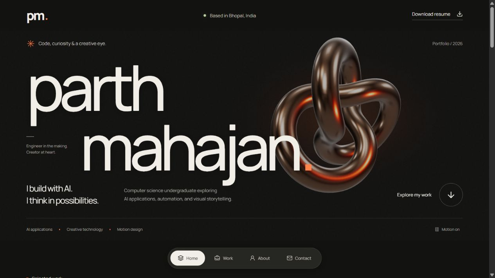

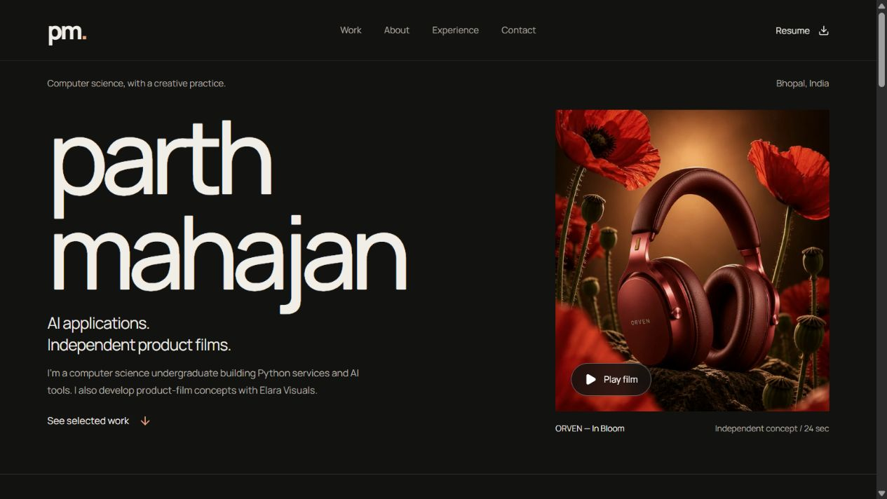

### 2. Work and project details — improved, evidence depth still limited

Before: decorative interface-like previews looked like generic mockups. Source links required opening a modal. Project maturity was less visible at a glance, while small labels and repeated decorative controls diluted hierarchy.

Fixed: technical previews now explain a specific mechanism: NextStep's default ranking weights and SentinelD's simplified approval workflow. These are labelled explanatory graphics, not product screenshots or measured outcomes. Prototype status and source links are visible on the page. Body text, spacing, and dialog controls are larger. Film cards use original project assets and retain fictional-concept attribution.

The default NextStep weights were checked against the project's ranking module: 40% skills, 30% semantic similarity, 20% preferences, 10% recency. Other ranking modes exist; the graphic does not describe all modes.

Remaining gap: real software screenshots or a short working demo, plus detailed decisions, constraints, and validated outcomes. Decorative graphics cannot replace this evidence. Nothing was invented to fill that gap.

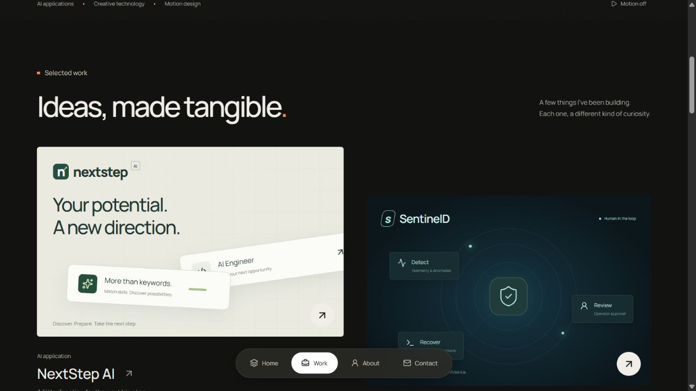

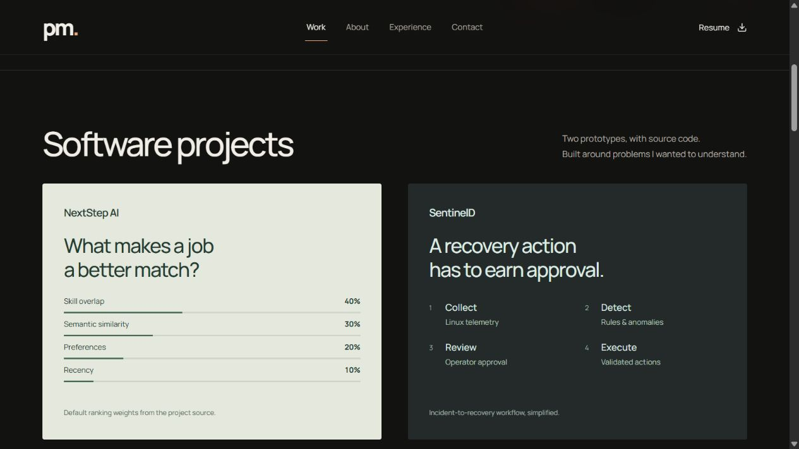

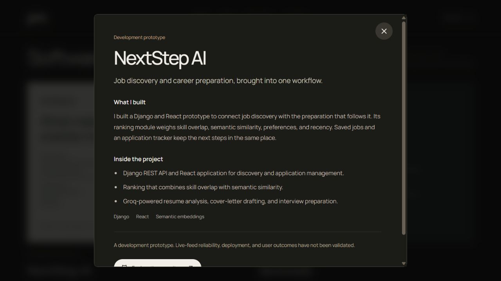

### 3. Biography and experience — healthy after revision

Before: “equal parts logic and imagination” and similar personality slogans felt interchangeable. A starburst and oversized statement drew attention away from supporting information.

Fixed: replaced slogans with education, robotics teaching, software interests, and film practice. Reduced ornament, enlarged copy, and used consistent rows for tools, education, and dated roles. Résumé dates and qualifications are preserved.

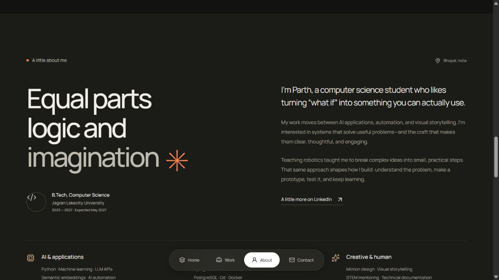

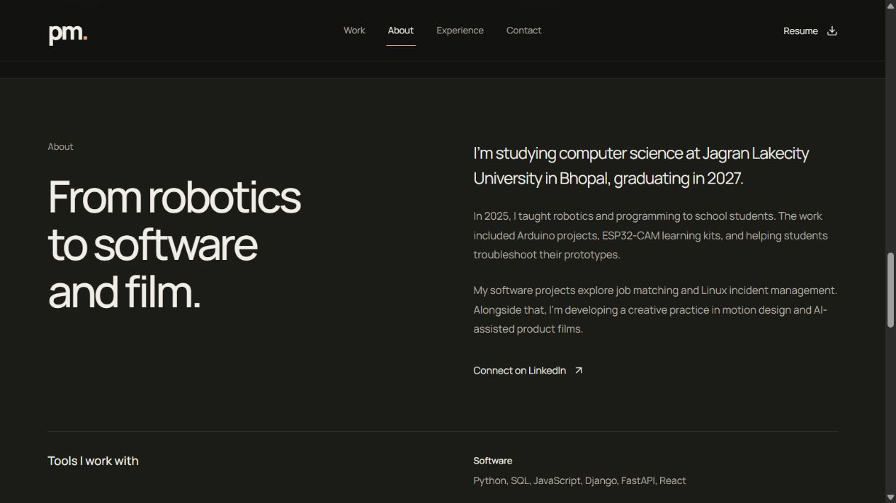

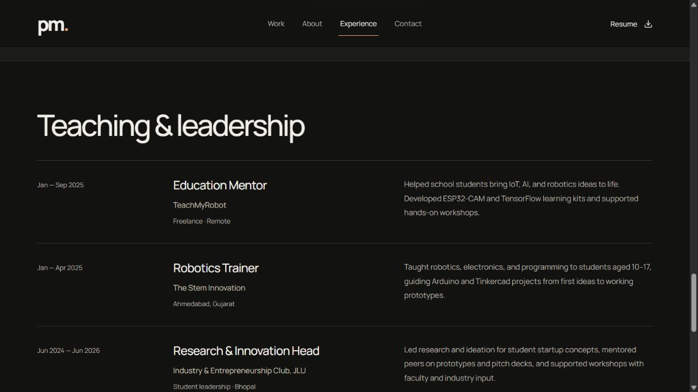

### 4. Navigation, contact, and phone layouts — healthy in tested preview

Before: the floating bottom navigation covered content. Small supporting text made phone scanning unnecessarily difficult.

Fixed: moved navigation to a sticky header, with a separate navigation row on phones. Increased interaction targets and readable copy sizes, kept a direct email link and visible copy feedback, and simplified contact wording. Dialogs retain Escape dismissal and focus restoration. Videos remain user initiated.

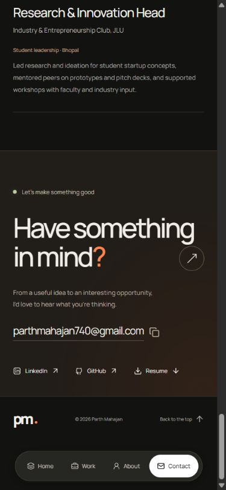

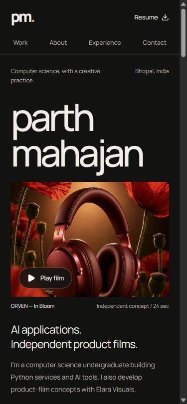

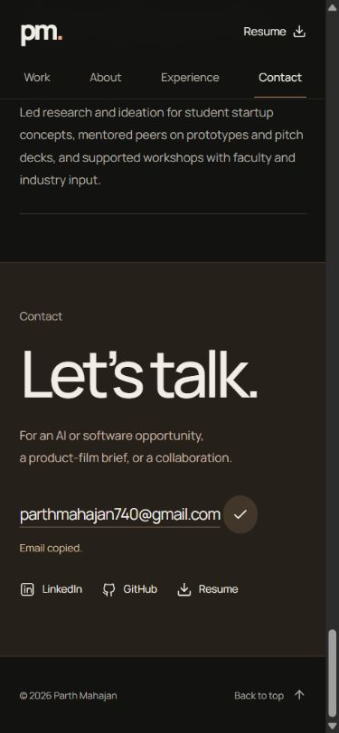

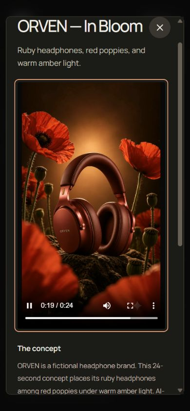

## The “too AI-generated” review

This checks visible template habits, not the technology used to create a site. The strongest V1 signals were interchangeable self-description, a generic 3D ornament, decorative simulated interfaces, too many small labels, and repeated pills/arrows. V2 removes or reduces those signals and connects the visual choices to specific work.

Residual template feel: **low to moderate**. Dark backgrounds, large sans-serif type, two-column cards, and “Let's talk” remain common conventions. Their presence alone is not a defect. More personal project evidence will distinguish this portfolio more effectively than adding unusual effects. ORVEN remains openly described as AI-assisted creative work; the review does not hide that fact.

## Comparison with live portfolios

All scores use the same weighted rubric: visual identity 25%, clarity and specificity 25%, project evidence 20%, readability 20%, navigation and discoverability 10%. Each criterion is out of ten; totals are rounded to one decimal. These compare the presentation of work, not the people's seniority or career worth. Small numerical differences are directional, not statistically meaningful.

| Portfolio | Identity 25% | Clarity 25% | Evidence 20% | Readability 20% | Navigation 10% | Total /10 |
| --- | ---: | ---: | ---: | ---: | ---: | ---: |
| Parth V1 | 6.5 | 5.5 | 6.0 | 5.0 | 7.5 | **6.0** |
| Parth V2 | 8.0 | 8.5 | 7.5 | 8.5 | 8.5 | **8.2** |
| [Marcus Lorenzet](https://www.marcuslorenzet.com/) | 9.0 | 8.5 | 8.5 | 7.5 | 8.0 | **8.4** |
| [Pamidor / Dor Sharaby](https://pamidordesign.co/) | 9.0 | 8.0 | 9.5 | 8.5 | 8.0 | **8.7** |
| [Brittany Chiang](https://brittanychiang.com/) | 8.0 | 9.0 | 9.0 | 9.0 | 9.0 | **8.8** |

**Marcus:** the portrait, oversized typography, and strong composition establish a memorable personal identity. The [Glide case study](https://www.marcuslorenzet.com/glide) includes challenge, audience, process, and deliverables. Its dramatic typography sometimes gives visual impact priority over scanning. Parth now has a clearer first impression, but less case-study depth.

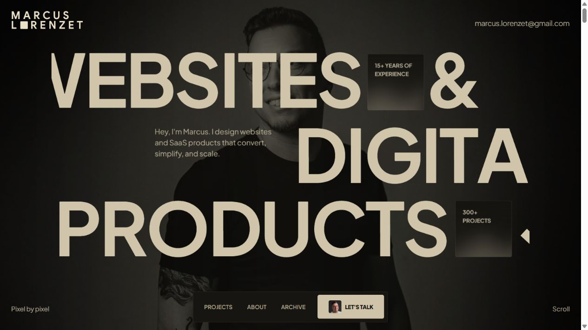

**Pamidor:** distinctive personal presentation is supported by substantial work. The [RISE case study](https://pamidordesign.co/work/rise) exposes role, timeline, contribution, discovery, flows, and an interactive product demonstration. That process evidence is its main advantage over Parth's short dialogs. Some broad creative language and dense presentation remain, so it is not a perfect benchmark in every dimension.

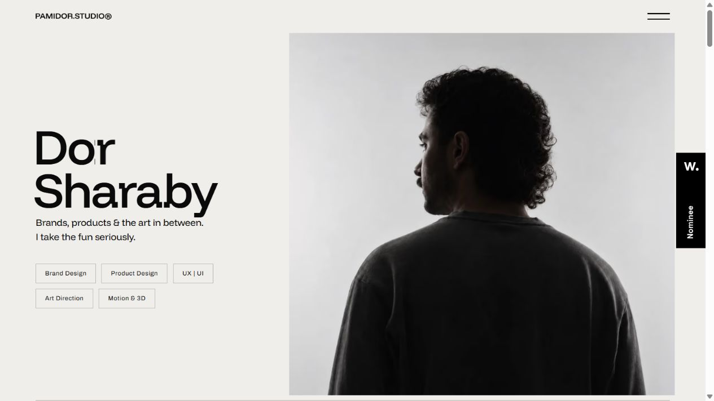

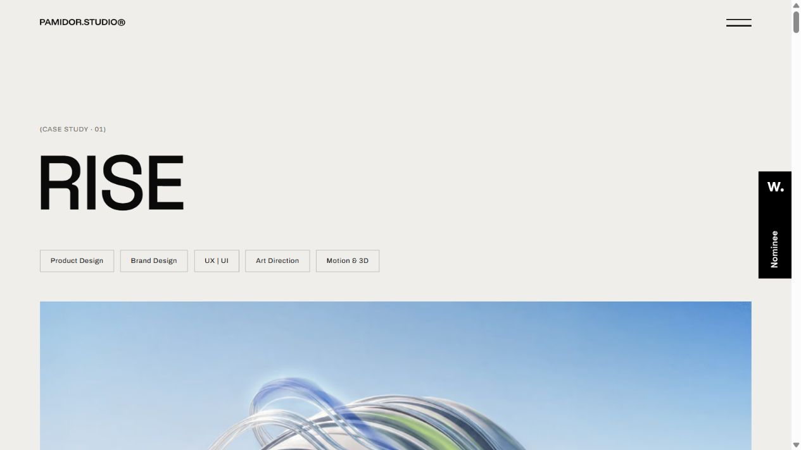

**Brittany:** the [homepage](https://brittanychiang.com/) is a useful engineering benchmark: immediate role clarity, specific experience, readable project descriptions, screenshots, and clear destinations. It scores highest here because this rubric rewards fast understanding and evidence as much as spectacle. Parth's film-led treatment is visually more cinematic; Brittany's presentation makes engineering credibility easier to evaluate.

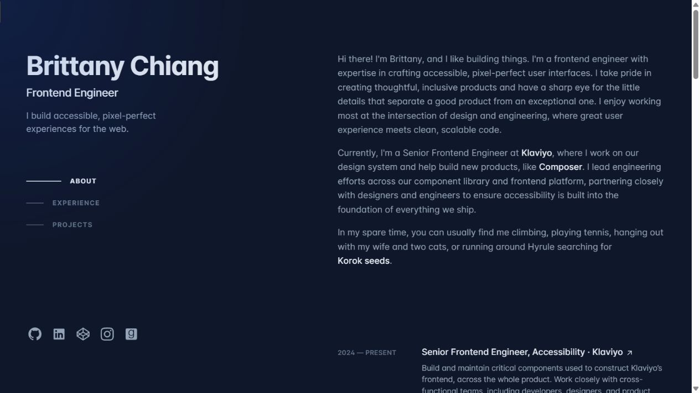

Benchmark scope: current desktop landing pages and representative project/case-study content. Benchmark scores do not imply a full mobile, accessibility, performance, or functional audit of those external sites. Client claims on those sites were not independently verified.

## Verification

- Production build passed. Final compiled JavaScript: 249.70 kB, 77.36 kB gzip. V1's main and decorative-scene bundles totalled approximately 792.20 kB uncompressed. Removing the scene reduced built JavaScript by about 68%; this is not a total page-weight or measured speed claim.
- Verified actual browser viewport widths of 320, 390, 560, 768, and 1440 pixels: no horizontal page overflow. Inspected desktop hero, work, biography, experience, and details; phone hero, contact, and film dialog.
- All four project dialogs opened. Escape closed NextStep and restored focus to its initiating button. SentinelD's phone dialog had equal content/client widths, with no horizontal overflow.
- ORVEN and LOOPPOP both reported 24-second duration, readyState 4, and playing state. ORVEN was observed advancing beyond 19 seconds. This was playback verification, not a new full film/audio editorial review.
- Email copy displayed “Email copied.” Social, repository, and résumé destinations match the current content sources. No email was sent.
- Production page, résumé, local font, both posters, and both films returned HTTP 200. The served résumé SHA-256 matches the supplied PDF exactly.
- No browser console errors observed in the final preview session. Production build passed and Git whitespace checks passed.
- Reduced-motion rules remain in CSS; there is no perpetual animation loop. This review is not a full WCAG audit or a multi-browser/device-lab test.

## What would improve the next version most

One deep, evidence-backed software case study would add more value than more decoration: show a real task in the product, explain a difficult decision, show an honest failure or limitation, and demonstrate what works now. Include measured results only when available. A genuine portrait is optional, not a substitute for that evidence.

The changes and preview are local. No public deployment or remote push was performed. The pre-revision source is preserved in [v1-source.zip](v1-source.zip).
